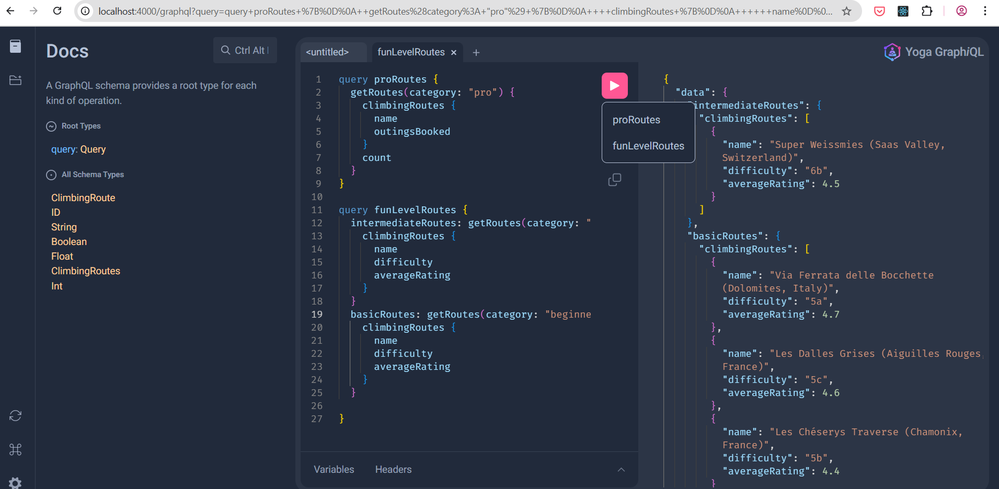
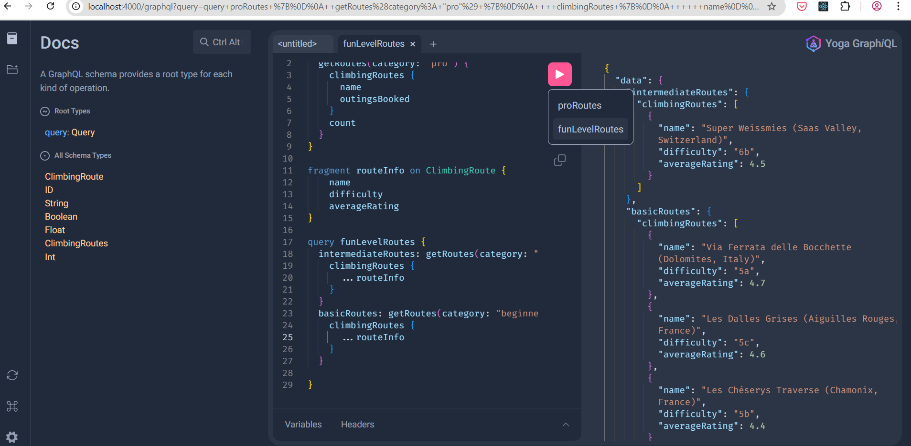

# GraphQL-Foundations

## Overview

This is a simple GraphQL demo app, to demonstrate the fundaments of GraphQL concepts using GraphQL Yoga (abstracts away the boilerplate required to set up a GraphQL server).
The application provides a catalog of climbing routes in Europe, with querying and filtering capabilities.
You can look at the docs and run your own queries at
`http://localhost:4000/graphql`
when the server is running:

<sub><i>(queries without fragments)</i></sub>

<sub><i>(queries with fragments - reusable blocks and cleaner code!)</i></sub>


## Tech Stack

- GraphQL
- GraphQL Yoga
- Node.js
- Typescript

## Getting Started

1. Install dependencies:

   ```bash
   npm install
   ```

2. Start the development server:
   ```bash
   npm start
   ```

## Project Structure

- `server.ts` - Sets up the GraphQL server using GraphQL Yoga and connects the schema to the server.
- `schema.ts` - Defines the GraphQL schema, including the types, queries, and their relationships.
- `resolvers.ts` - Implements the logic for resolving GraphQL queries and connecting them to the data sources.